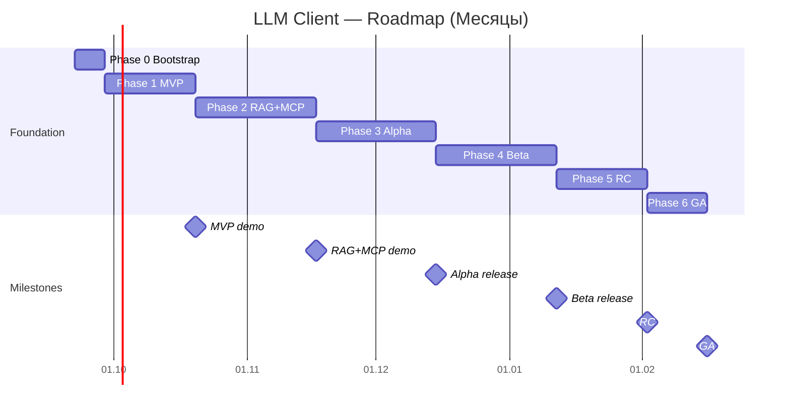

# ROADMAP.md — Дорожная карта LLM Client

| Атрибут | Значение |
|---|---|
| Версия документа | 1.0.0 |
| Дата | 2026-09-19 |
| Статус | Draft → Review → Approved |
| Связанный документ | [ARCHITECT.md](./ARCHITECT.md) |
| Методология | Принцип Парето 80/20 (20% усилий → 80% результата) + incremental delivery |
| Команда | 2 backend-разработчика (MVP) → +1 DevOps (Phase 3) → +1 frontend (Phase 5) |

---

## 1. Подход и методология

### 1.1 Принцип Парето 80/20

Принцип Парето (правило 80/20) гласит: **20% усилий дают 80% результата**. Применительно к нашему LLM Client это означает: мы выделяем **минимальное подмножество функций**, которое закрывает **80% пользовательских сценариев**, и доставляем его в Phase 1 (MVP). Оставшиеся 80% усилий (Phases 2-6) направлены на:

- надёжность и отказоустойчивость,
- масштабируемость,
- безопасность,
- observability,
- UX-полировку,
- edge-cases и compliance.

### 1.2 Карта ценности: что даёт 80% результата

Пользовательские сценарии ранжированы по ценности (от максимума к минимуму):

| # | Сценарий | Ценность | Сложность | В фазе |
|---|---|---|---|---|
| 1 | Спросить LLM в чате, получить streaming-ответ | Very High | Low | Phase 1 (MVP) |
| 2 | Переключить модель (OpenAI/Claude) | High | Low | Phase 1 |
| 3 | Сохранить ответ в MD/TXT | High | Low | Phase 1 |
| 4 | Сохранить ответ в PDF/DOCX/XLSX | Medium | Medium | Phase 1 (базово) / 2 (полировка) |
| 5 | Агент делает web search и цитирует источники | High | Medium | Phase 1 |
| 6 | История сессий, переключение между ними | Medium | Low | Phase 1 |
| 7 | RAG-поиск по загруженным документам | High | Medium | Phase 2 |
| 8 | MCP-инструменты (filesystem, github) | Medium | Medium | Phase 2 |
| 9 | Сохранение в ODT/DOC (legacy) | Low | Medium | Phase 3 |
| 10 | Auth + multi-user | High (prod) | Medium | Phase 3 |
| 11 | Observability (метрики, трейсинг, cost tracking) | Medium (prod) | Medium | Phase 3-4 |
| 12 | Horizontal scale, K8s | Low (MVP) | High | Phase 6 |
| 13 | Local LLM через Ollama | Low (MVP) | Medium | Phase 4 |
| 14 | MCP Server mode (экспорт наших tools) | Low | Medium | Phase 6 |

**Сценарии 1-6 = 20% усилий, ~80% perceived value → Phase 1 (MVP).**

### 1.3 Принципы поставки

- **Incremental & working software**: каждая фаза заканчивается **demoable** приложением.
- **Vertical slices**: в каждой фазе добавляем полную вертикаль (UI + agent + storage + tests).
- **Definition of Done (DoD)**: чёткий checklist по каждой фазе, без «soft» критериев.
- **Timeboxed**: фазы фиксированы по длительности; scope гибкий, time — нет.
- **Risk-driven**:高风险ные элементы (spike на совместимость Streamlit+LangGraph, MCP-in-docker) — в начале.

---

## 2. Канва фаз

| Фаза | Длительность | Цель | Главная ценность | Команда |
|---|---|---|---|---|
| Phase 0 | 1 неделя | Bootstrap проекта, CI, dev-env | Репозиторий, docker-compose skeleton, первые тесты | 2 dev |
| **Phase 1 (MVP)** | **3 недели** | **20% усилий → 80% ценности** | Chat + tool calling + web search + базовый file export | 2 dev |
| Phase 2 | 4 недели | RAG + MCP | Полноценный агент с knowledge base и MCP tools | 2 dev |
| Phase 3 | 4 недели | Alpha: auth, observability, all formats | Production-ready single-instance | 2 dev + 0.5 DevOps |
| Phase 4 | 4 недели | Beta: ollama, fallbacks, perf | Resilient, multi-provider, оптимизированный | 2 dev + 1 DevOps |
| Phase 5 | 3 недели | Release Candidate | UX-полировка, docs, security audit | 2 dev + 1 DevOps + 0.5 frontend |
| Phase 6 | 2 недели + ongoing | GA + Scale | Multi-instance, K8s-ready, on-call runbooks | 2 dev + 1 DevOps |

**Итого time-to-MVP**: 4 недели (Phase 0 + Phase 1).
**Итого time-to-GA**: ~21 неделя (~5 месяцев).

---

## 3. Фаза 0 — Bootstrap (1 неделя)

### 3.1 Цель

Подготовить инфраструктуру разработки: репозиторий, CI/CD, dev-окружение, базовый skeleton. **Без бизнес-логики**.

### 3.2 Scope

- [ ] Создать git-репозиторий, ветвление `main` / `develop`, branch protection.
- [ ] Инициализировать `pyproject.toml` (Poetry / uv / hatch), зависимость `python>=3.11`.
- [ ] Базовые dev-зависимости: `ruff`, `mypy`, `pytest`, `pytest-asyncio`, `pre-commit`.
- [ ] `docker-compose.yml` skeleton: postgres, redis (без приложения).
- [ ] CI pipeline (GitHub Actions): lint + type-check + tests на каждый PR.
- [ ] README.md с инструкцией запуска `docker compose up`.
- [ ] `.env.example`, `.gitignore`, `LICENSE` (MIT).
- [ ] Заготовка структуры каталогов из ARCHITECT.md §10.
- [ ] Pre-commit hooks: ruff, mypy, end-of-file-fixer.
- [ ] Makefile: `make dev`, `make test`, `make lint`, `make migrations`.

### 3.3 Definition of Done (DoD)

| Критерий | Способ проверки |
|---|---|
| `make dev` поднимает postgres+redis | `docker compose ps` показывает healthy |
| CI зелёный на пустом PR | GitHub Actions check ✓ |
| `ruff check .` без ошибок | local run |
| `mypy src/` без ошибок | local run |
| README описывает setup и dev-цикл | code review |
| Alembic init + первая empty migration | `alembic upgrade head` работает |

### 3.4 Риски и митигации

| Риск | Mitigation |
|---|---|
| Команда не знакома с Poetry/uv | Spike в день 1, выбор по простоте |
| LangGraph version conflicts с LangChain | Зафиксировать версии в Phase 0, не апгрейдить до Phase 2 |

### 3.5 Deliverables

- Репозиторий `llm-client` с skeleton.
- `docker-compose.yml` для dev.
- CI/CD pipeline.
- `.env.example`.

---

## 4. Фаза 1 — MVP (3 недели) ⭐ 20% усилий / 80% результата

### 4.1 Цель

Доставить **минимально полезное приложение**: пользователь может открыть чат в Streamlit, спросить LLM, получить streaming-ответ, попросить агента сделать web search, и сохранить результат в файл (md/txt/pdf/docx/xlsx базово).

### 4.2 Scope (что обязательно в MVP)

**UI (Streamlit)**:
- [ ] Базовый `st.chat_input` + `st.chat_message` интерфейс.
- [ ] Streaming-рендер ответа через `st.write_stream`.
- [ ] Боковая панель: выбор провайдера (OpenAI/Claude), модели, температуры.
- [ ] Сохранение истории чата в `st.session_state` (in-memory).
- [ ] Кнопка скачивания ответа в `.md` и `.txt`.

**Agent (LangGraph)**:
- [ ] `StateGraph` с одним узлом `agent` + `tools` (AgentExecutor-стиль).
- [ ] Биндинг tools через `llm.bind_tools([...])`.
- [ ] Tool calling loop: max 5 итераций.
- [ ] Streaming через `astream_events`.

**LLM Provider Layer**:
- [ ] `LLMProviderFactory` с реализациями для OpenAI и Anthropic.
- [ ] Переключение через UI settings panel.
- [ ] Базовый retry (3 попытки, exponential backoff).

**Tools**:
- [ ] `web_search` через Tavily API (top-5 результатов).
- [ ] `file_export` для форматов: `md`, `txt` (полная поддержка), `pdf`, `docx`, `xlsx` (базовая — text-only контент, без сложного форматирования).

**Persistence**:
- [ ] SQLAlchemy 2.0 async + PostgreSQL.
- [ ] Таблицы: `users`, `sessions`, `messages`, `files`, `llm_calls`.
- [ ] Alembic миграции.
- [ ] Сохранение сообщений и истории сессий в БД.
- [ ] LangGraph `PostgresSaver` для чекпойнтов.

**Vector store**:
- [ ] Chroma как единственный store в MVP (локальный, zero-config).

**Config & observability**:
- [ ] Pydantic Settings (`config.py`).
- [ ] `structlog` JSON в stdout.
- [ ] Базовый health check `/healthz` (если FastAPI BFF) или Streamlit-экран.

### 4.3 Вне MVP (явно исключаем)

- ❌ RAG-поиск (Phase 2).
- ❌ MCP client (Phase 2).
- ❌ Форматы `.odt`, `.doc` (legacy), `.xls` (Phase 3).
- ❌ Auth / multi-user (Phase 3).
- ❌ Local LLM через Ollama (Phase 4).
- ❌ OpenTelemetry tracing (Phase 3).
- ❌ Fallback chain между провайдерами (Phase 4).
- ❌ Background worker (всё синхронно в MVP).

### 4.4 Definition of Done (DoD)

| Критерий | Способ проверки |
|---|---|
| Пользователь может вести чат с GPT-4o-mini | ручной тест |
| Streaming ответов работает (< 2 сек TTFT) | замер |
| Можно переключиться на Claude 3.5 Sonnet | ручной тест, выбор в UI |
| Агент делает web search и возвращает sources | ручной запрос "найди новости про X" |
| Кнопка "Сохранить в .md" создаёт файл и позволяет скачать | ручной тест |
| Кнопка "Сохранить в .pdf" через reportlab работает | ручной тест |
| История сессий сохраняется в БД, можно вернуться | перезапуск приложения, сессия видна |
| LangGraph checkpoint сохраняется в Postgres | `SELECT count(*) FROM agent_checkpoints` > 0 |
| LLM call метрики пишутся в `llm_calls` | SQL query |
| Test coverage > 60% для `src/llm_client/agent/` и `src/llm_client/llm/` | `pytest --cov` |
| `docker compose up` поднимает всё приложение | single command |
| README обновлён со скриншотами и quickstart | code review |

### 4.5 Спайки (Spike) в начале фазы

| Spike | Длительность | Цель |
|---|---|---|
| Streamlit + LangGraph async | 1 день | Доказать, что streaming работает через `st.write_stream` |
| Tavily API integration | 0.5 дня | Получить API key, проверить формат ответа |
| ReportLab basic PDF | 0.5 дня | Минимальный PDF из строки текста |

### 4.6 Метрики успеха MVP

| Метрика | Target |
|---|---|
| Time-to-first-token | < 2 сек |
| Time-to-full-answer (без tools) | < 8 сек |
| Успешных чат-сессий в день (пилот) | ≥ 10 |
| NPS пилотной группы | ≥ 7/10 |
| Багов с severity High+ | ≤ 3 |
| Test coverage | > 60% |
| Docs completeness | > 70% |

### 4.7 Риски

| Риск | Вероятность | Влияние | Митигация |
|---|---|---|---|
| Streamlit не дружит с LangGraph async | Medium | High | Spike в день 1, fallback: синхронизация через `asyncio.run` |
| Tavily лимиты на free tier | High | Low | Buy paid plan ($30/мес), fallback на DuckDuckGo lib |
| ReportLab complexity для PDF | Medium | Low | Использовать fpdf2 как альтернативу, если reportlab застрянет |
| Cost overrun на LLM | Medium | Medium | Hard cap 50k tokens/day per user, alerting в `llm_calls` |

### 4.8 Примерное распределение человеко-дней (15 дней на 2 dev = 30 чел-дней)

| Задача | Чел-дней |
|---|---|
| UI (Streamlit chat, settings, history) | 5 |
| Agent + LangGraph graph + tool calling | 6 |
| LLM provider layer (OpenAI + Anthropic) | 3 |
| Tools: web_search + file_export (5 форматов) | 5 |
| Persistence (PostgreSQL, миграции, repos) | 4 |
| Observability (structlog, basic metrics) | 2 |
| Docker, CI, deployment | 2 |
| Testing (unit + integration) | 3 |

---

## 5. Фаза 2 — RAG + MCP (4 недели)

### 5.1 Цель

Добавить две ключевые capability: **RAG-поиск по загруженным документам** и **MCP Client** для подключения внешних инструментов. После Phase 2 приложение покрывает ~95% целевых сценариев.

### 5.2 Scope

**RAG Layer**:
- [ ] Document loaders: PDF, DOCX, MD, TXT, HTML.
- [ ] `RecursiveCharacterTextSplitter` (1000/200), опционально `SemanticChunker`.
- [ ] Embeddings: OpenAI `text-embedding-3-small`.
- [ ] Vector store: Chroma (default) + Qdrant adapter (production-ready).
- [ ] `VectorStoreFactory` с тремя адаптерами (Chroma, Qdrant, pgvector).
- [ ] UI: форма загрузки файлов + индексация в background.
- [ ] Retriever: similarity + MMR (k=8, fetch_k=20).
- [ ] RAG tool: `rag_query(query, k=8)` — agent может сам решать, когда искать в базе.
- [ ] Sources panel: список документов и чанков с подсветкой.

**MCP Client**:
- [ ] Интеграция `mcp` Python SDK.
- [ ] `MCPClientManager` с поддержкой stdio + SSE transports.
- [ ] Динамическая регистрация MCP tools в `tool_registry` с namespace (`filesystem.read_file`).
- [ ] Подключение 2 reference MCP-серверов: `@modelcontextprotocol/server-filesystem` и `@modelcontextprotocol/server-github`.
- [ ] UI: страница настройки MCP-серверов (add/remove/test connection).
- [ ] Graceful degradation: если MCP-сервер недоступен, tool исключается из биндинга.

**Agent updates**:
- [ ] Planner node: smarter routing (RAG vs web_search vs direct LLM).
- [ ] `rag_retriever` node в графе.
- [ ] `mcp_invoker` node в графе.
- [ ] Conditional edges для маршрутизации.

**Persistence**:
- [ ] Таблица `documents` для метаданных RAG.
- [ ] Upload endpoint: сохранение файла → индексация → запись в `documents`.

### 5.3 DoD

| Критерий | Способ проверки |
|---|---|
| Загрузка PDF → индексация в Chroma → поиск находит нужный чанк | ручной тест |
| Переключение `VECTOR_STORE_KIND=qdrant` работает без код-изменений | env switch + test |
| pgvector как третий вариант работает | env switch + test |
| Agent сам решает вызвать `rag_query` для вопроса по документам | trace в LangSmith |
| MCP filesystem server: `read_file` через agent работает | ручной тест |
| MCP github server: `create_issue` через agent работает | ручной тест |
| При отключении MCP-сервера приложение не падает | kill server + restart |
| Test coverage > 70% для RAG и MCP layers | pytest --cov |

### 5.4 Риски

| Риск | Mitigation |
|---|---|
| MCP stdio в docker-compose требует sidecar контейнеров | Использовать SSE-transport где можно; для stdio — subprocess в sidecar |
| Qdrant + Chroma расходятся в schema/поведении | Contract tests на общий `VectorStore` интерфейс |
| RAG retrieval quality ниже ожидаемого | Spike на chunk size + MMR params; метрика recall@10 |
| Cost embeddings при больших документах | Batch embedding, кэш в Redis по content_hash |

### 5.5 Метрики

| Метрика | Target |
|---|---|
| RAG recall@10 | > 0.75 |
| RAG retrieval latency | < 500 мс |
| MCP tool call success rate | > 95% |
| Documents indexed per day | > 100 |
| Agent routing accuracy (правильно выбрал tool) | > 80% |

---

## 6. Фаза 3 — Alpha: Auth + Observability + All formats (4 недели)

### 6.1 Цель

Превратить MVP+RAG+MVP в **single-instance production-ready** приложение: добавить auth, full observability, оставшиеся форматы файлов, базовый security hardening.

### 6.2 Scope

**Auth & Security**:
- [ ] OAuth2/OIDC через Keycloak или Authentik (self-hosted).
- [ ] JWT-токены, refresh flow.
- [ ] Multi-user с изоляцией данных (RLS в PostgreSQL).
- [ ] Path whitelisting для file_export и MCP filesystem.
- [ ] PII masking в логах (regex-based, позже Presidio).
- [ ] Rate limiting per-user (Redis-based token bucket).

**File export — финальные форматы**:
- [ ] `odt` через `odfpy`.
- [ ] `doc` (legacy Word 97-2003) через `python-docx` + конвертация, либо LibreOffice subprocess.
- [ ] `xls` (legacy Excel) через `xlwt` или конвертация.
- [ ] Расширенная поддержка `pdf` (заголовки, таблицы, изображения через ReportLab Platypus).
- [ ] Расширенная поддержка `docx` (стили, заголовки, списки через `python-docx`).
- [ ] Расширенная поддержка `xlsx` (multiple sheets, формулы, стили через `openpyxl`).

**Observability**:
- [ ] OpenTelemetry auto-instrumentation для HTTP, DB, LLM calls.
- [ ] OTLP exporter в Jaeger / Tempo.
- [ ] Prometheus metrics: `llm_tokens_total`, `llm_latency_seconds`, `tool_calls_total`, `rag_retrieval_seconds`.
- [ ] Grafana dashboard: requests, latency p50/p95/p99, cost, errors.
- [ ] LangSmith интеграция (или self-hosted Langfuse) для LLM traces.
- [ ] Cost dashboard per user/session/day.

**Background worker (опционально)**:
- [ ] Celery или RQ + Redis broker.
- [ ] Очередь для тяжёлых file rendering jobs (>1MB).
- [ ] UI: прогресс-бар для асинхронных задач.

**DevOps**:
- [ ] `docker-compose.prod.yml` с production overrides (nginx, TLS, resource limits).
- [ ] Health/readiness probes.
- [ ] Daily Postgres backup в S3-compatible (MinIO).
- [ ] Runbooks для типовых инцидентов.

### 6.3 DoD

| Критерий | Способ проверки |
|---|---|
| Login через Keycloak работает | ручной тест |
| Данные пользователя A не видны пользователю B | SQL test с двумя сессиями |
| Все 8 форматов файлов (`md`, `txt`, `pdf`, `doc`, `docx`, `odt`, `xls`, `xlsx`) генерируются корректно | unit tests + manual |
| Jaeger trace виден для каждого LLM call | Jaeger UI |
| Grafana dashboard показывает метрики в реальном времени | Grafana URL |
| Cost dashboard корректно агрегирует `llm_calls` | SQL+dashboard |
| Daily backup восстанавливается | restore test |
| Runbook покрывает 5+ типовых инцидентов | docs review |

### 6.4 Риски

| Риск | Mitigation |
|---|---|
| Keycloak setup complex | Использовать Authentik (проще) или hosted Auth0 |
| `doc`/`xls` legacy форматы не поддерживаются в modern libs | Spike: LibreOffice subprocess как fallback |
| OpenTelemetry adds overhead | Sampling: 10% traces, 100% metrics |
| Cost dashboard inaccurate | Cross-check с billing API провайдеров |

---

## 7. Фаза 4 — Beta: Local LLM + Fallbacks + Perf (4 недели)

### 7.1 Цель

Добавить **resilience** (fallback chain, local LLM через Ollama) и **оптимизировать** производительность (caching, context compression).

### 7.2 Scope

**LLM provider enhancements**:
- [ ] `ChatOllama` integration для локальных моделей (Llama 3.1, Qwen, Mistral).
- [ ] `LiteLLM` gateway как опциональный proxy (для unified billing).
- [ ] Fallback chain: OpenAI → Anthropic → Ollama (config-driven, max 5 errors → switch).
- [ ] ReAct fallback для моделей без native function calling.
- [ ] Token usage accurate tracking (включая Ollama).

**Performance**:
- [ ] Redis cache для LLM responses (по hash(prompt+model+temperature)).
- [ ] Redis cache для embeddings (по content_hash).
- [ ] Context compression: `LLMChainExtractor` для длинных RAG контекстов.
- [ ] Streaming optimization: early tool-call detection.
- [ ] DB connection pool tuning (asyncpg pool_size, statement_timeout).

**RAG enhancements**:
- [ ] Hybrid search: BM25 (`rank_bm25`) + vector search + reranking.
- [ ] Query rewriting через LLM (лучшие результаты на сложных запросах).
- [ ] Document ingestion pipeline: incremental updates, deduplication.
- [ ] BGE embeddings для offline режима.

**MCP enhancements**:
- [ ] Reconnect logic для упавших MCP-серверов.
- [ ] Tool result caching (для идемпотентных tools).
- [ ] Configurable timeout per MCP server.

### 7.3 DoD

| Критерий | Способ проверки |
|---|---|
| Ollama работает как третий провайдер | UI switch + test |
| Fallback chain срабатывает при 5 errors | mock-тест: retry-fail-fallback |
| Cache hit rate > 30% для повторяющихся запросов | Redis stats |
| Context compression уменьшает prompt на 50%+ для длинных RAG | mock-тест |
| Hybrid search recall@10 > 0.85 | eval dataset |
| Latency p95 < 10 сек для tool-calling ответов | load test |

---

## 8. Фаза 5 — Release Candidate (3 недели)

### 8.1 Цель

Подготовить приложение к GA: UX-полировка, документация, security audit, performance tuning.

### 8.2 Scope

**UX**:
- [ ] Переработанный chat UI (markdown rendering, code blocks, syntax highlighting).
- [ ] Tool-call preview UI (показывает, какой tool вызывается, прогресс, результат).
- [ ] Citations panel с кликабельными ссылками на источники.
- [ ] Responsive layout для tablet/mobile (если Streamlit позволяет).
- [ ] Dark mode.
- [ ] Onboarding tour для новых пользователей.

**Documentation**:
- [ ] User guide (как пользоваться, примеры промптов).
- [ ] Admin guide (как настраивать MCP-серверы, провайдеров, лимиты).
- [ ] API docs (если есть FastAPI BFF).
- [ ] Архитектурные ADR-записи финализированы.
- [ ] Video demo.

**Security audit**:
- [ ] External pentest (или internal с помощью OWASP ZAP).
- [ ] SAST (bandit, semgrep) в CI.
- [ ] Dependency audit (`pip-audit`, Dependabot).
- [ ] Secrets scan (trufflehog).
- [ ] Threat model review (STRIDE).

**Performance & load**:
- [ ] Load test: 50 concurrent users, 100 RPS, целевые SLO.
- [ ] Soak test: 24 часа под нагрузкой, проверка memory leaks.
- [ ] Spike test: x3 traffic burst.

**Compliance**:
- [ ] GDPR: data export endpoint, right-to-be-forgotten.
- [ ] Audit log retention 90 дней.
- [ ] Backup restore drill.

### 8.3 DoD

| Критерий | Способ проверки |
|---|---|
| UX review с пилотными пользователями | NPS ≥ 8/10 |
| All SAST/SAST issues resolved | CI green |
| Load test: 50 users, p95 < 10 сек | k6/locust report |
| Soak test: 24h без memory leak | monitoring dashboards |
| Pentest: 0 critical/high findings | report |
| Backup restore: RTO < 1 час, RPO < 24 часа | drill |
| All docs published in `/docs` | docs portal |

---

## 9. Фаза 6 — GA + Scale (2 недели + ongoing)

### 9.1 Цель

General Availability и подготовка к горизонтальному масштабированию.

### 9.2 Scope

**Multi-instance readiness**:
- [ ] Streamlit session state → external session store (Redis).
- [ ] Sticky sessions или stateless UI.
- [ ] Health checks для K8s liveness/readiness.
- [ ] Helm chart (Phase 6+).
- [ ] HPA based on CPU/RPS.
- [ ] Blue-green or canary deployment strategy.

**Operational excellence**:
- [ ] On-call runbook с paging rules.
- [ ] Alerting rules (Prometheus alertmanager).
- [ ] SLO/SLI definition и monitoring.
- [ ] Incident response process (5-min response, 30-min mitigation).
- [ ] Postmortem template.

**Optional future capabilities** (post-GA):
- [ ] MCP Server mode (экспорт наших tools как MCP).
- [ ] Multi-tenant isolation (schemas или separate DBs).
- [ ] Custom tools marketplace.
- [ ] Real-time collaboration (WebSocket).
- [ ] Mobile app.

### 9.3 DoD

| Критерий | Способ проверки |
|---|---|
| K8s deployment успешно | helm install + smoke test |
| HPA scales on load | load test на cluster |
| Alerting: SLO breach triggers page | synthetic incident |
| On-call rotation active | PagerDuty schedule |
| SLO: 99.9% uptime за 30 дней | monitoring |

---

## 10. Диаграмма Ганта

---

## 11. Матрица зависимостей

| Фаза | Зависит от | Блокирует |
|---|---|---|
| Phase 0 | — | Phase 1 |
| Phase 1 (MVP) | Phase 0 | Phase 2 |
| Phase 2 (RAG+MCP) | Phase 1 | Phase 3 |
| Phase 3 (Alpha) | Phase 2 | Phase 4, Phase 5 |
| Phase 4 (Beta) | Phase 3 | Phase 5 |
| Phase 5 (RC) | Phase 3, Phase 4 | Phase 6 |
| Phase 6 (GA) | Phase 5 | post-GA initiatives |

**Параллелизация**: часть Phase 3 (auth, observability) может стартовать параллельно с Phase 2 если есть 3-й разработчик. Часть Phase 5 (UX) может идти параллельно с Phase 4.

---

## 12. Риски и митигации (consolidated)

| ID | Риск | Фаза | Вероятность | Влияние | Mitigation |
|---|---|---|---|---|---|
| R-1 | Streamlit + LangGraph async несовместимость | P1 | Medium | High | Spike в день 1 Phase 1 |
| R-2 | Tavily API лимиты | P1 | High | Low | Paid plan, DDG fallback |
| R-3 | MCP stdio в docker-compose | P2 | High | Medium | SSE transport, sidecar pattern |
| R-4 | RAG retrieval quality низкий | P2 | Medium | High | Spike на chunker + MMR + eval set |
| R-5 | Qdrant/Chroma schema divergence | P2 | Medium | Medium | Contract tests |
| R-6 | Keycloak complexity | P3 | Medium | Medium | Authentik или hosted Auth0 |
| R-7 | Cost overrun на LLM | P1-P5 | High | High | Hard caps, alerting, cost dashboard |
| R-8 | LangSmith pricing | P3-P5 | High | Medium | Langfuse self-hosted fallback |
| R-9 | Streamlit horizontal scale issues | P6 | High | High | Migrate to Chainlit/Next.js |
| R-10 | MCP ecosystem immature | P2-P4 | Medium | Medium | Pin MCP SDK versions, own tests |
| R-11 | OpenTelemetry overhead | P3 | Low | Medium | Sampling, 10% traces |
| R-12 | Legacy formats (`.doc`, `.xls`) complexity | P3 | Medium | Low | LibreOffice subprocess fallback |
| R-13 | Memory leaks при long-running Streamlit | P5 | Medium | High | Soak test, restart policy |
| R-14 | PII leakage в logs | P3-P5 | Medium | High | Presidio, audit, sampling |

---

## 13. Метрики успеха (KPI / OKR)

### 13.1 Objective 1: Доставка MVP в срок

| KR | Target | Способ измерения |
|---|---|---|
| KR1.1 Time-to-MVP | ≤ 4 недели (Phase 0+1) | calendar |
| KR1.2 MVP scope completeness | 100% Phase 1 DoD | checklist |
| KR1.3 Pilot users active | ≥ 5 weekly active | analytics |

### 13.2 Objective 2: Пользовательская ценность

| KR | Target | Способ измерения |
|---|---|---|
| KR2.1 NPS после MVP | ≥ 7/10 | survey |
| KR2.2 NPS после Phase 5 (RC) | ≥ 8/10 | survey |
| KR2.3 Avg time-to-answer | < 10 сек | metrics |
| KR2.4 File export success rate | > 99% | metrics |

### 13.3 Objective 3: Production readiness

| KR | Target | Способ измерения |
|---|---|---|
| KR3.1 Uptime (GA) | 99.9% / 30 дней | monitoring |
| KR3.2 p95 latency (tool-calling) | < 10 сек | metrics |
| KR3.3 Test coverage | > 80% | pytest --cov |
| KR3.4 Bug escape rate (post-release) | < 2 critical/quarter | issue tracker |
| KR3.5 On-call response time | < 5 мин (P0), < 30 мин (P1) | PagerDuty |

### 13.4 Objective 4: Cost efficiency

| KR | Target | Способ измерения |
|---|---|---|
| KR4.1 Cost per active user / month | < $50 | billing |
| KR4.2 Cache hit rate | > 30% | Redis stats |
| KR4.3 Token efficiency (output/input ratio) | > 0.5 | llm_calls aggregation |

---

## 14. Командные роли (RACI)

| Роль / Активность | Backend Dev 1 | Backend Dev 2 | DevOps | Frontend | PM | Архитектор |
|---|---|---|---|---|---|---|
| Architecture decisions | R | C | I | I | I | A |
| Phase 0 bootstrap | R | R | C | I | I | C |
| Phase 1 MVP | R | R | C | I | I | C |
| Phase 2 RAG+MCP | R | R | I | I | C | C |
| Phase 3 Auth+Obs | R | R | A | I | C | C |
| Phase 4 Beta | R | R | C | I | C | C |
| Phase 5 RC | R | R | C | A | C | C |
| Phase 6 GA+Scale | C | C | A | C | C | R |

**Legend**: R=Responsible, A=Accountable, C=Consulted, I=Informed.

---

## 15. Технологический долг

Каждая фаза явно выделяет ~10-15% времени на погашение техдолга:

| Фаза | Техдолг, который закрываем |
|---|---|
| Phase 1 | — (нет долга в MVP) |
| Phase 2 | Refactor tool_registry: единый интерфейс, type-safe binding |
| Phase 3 | Заменить regex PII masking на Presidio |
| Phase 4 | Унифицировать embeddings cache (общий с LLM cache) |
| Phase 5 | Refactor LangGraph graph definition — extract в YAML |
| Phase 6 | Миграция Streamlit → Chainlit (если потребует scale) |

---

## 16. Критерии перехода между фазами (Phase Gate Checklist)

Каждая фаза считается завершённой только если:

- [ ] **All DoD criteria met.**
- [ ] **Tests green** (unit + integration + e2e smoke).
- [ ] **No open critical/high bugs.**
- [ ] **Demo проведён** со стейкхолдерами.
- [ ] **ADR обновлены** (если изменились архитектурные решения).
- [ ] **Runbooks обновлены** (Phase 3+).
- [ ] **Phase retrospective** проведена (что хорошо/плохо/improve).

Без этих критериев переход на следующую фазу **не разрешён**.

---

## 17. Что делать после GA

Дорожная карта заканчивается на Phase 6 (GA), но развитие продолжается. Возможные следующие инициативы:

1. **MCP Server mode** — экспорт наших tools как MCP для других агентов.
2. **Multi-tenant** — изоляция данных разных команд.
3. **Custom tools marketplace** — пользователи могут добавлять свои tools через UI.
4. **Fine-tuning pipeline** — дообучение локальных моделей на истории чатов.
5. **Mobile app** — нативные клиенты (iOS/Android).
6. **Real-time collaboration** — WebSocket-based multi-user editing.
7. **Voice mode** — ASR + TTS интеграция.
8. **Agentic workflows** — преднастроенные графи для типовых задач (research, code review, doc gen).

Эти инициативы должны оцениваться отдельно и могут запускаться параллельно с основным roadmap.

---

## 18. References

- ARCHITECT.md — детальная архитектура.
- `docs/adr/` — Architecture Decision Records (ADR-001..008).
- `docs/runbooks/` — операционные runbooks.
- LangGraph: https://langchain-ai.github.io/langgraph/
- LangChain: https://python.langchain.com/docs/
- MCP: https://modelcontextprotocol.io/

---
*Конец ROADMAP.md. Документ пересматривается в конце каждой фазы; изменения трекать в `docs/roadmap-changelog.md`.*
